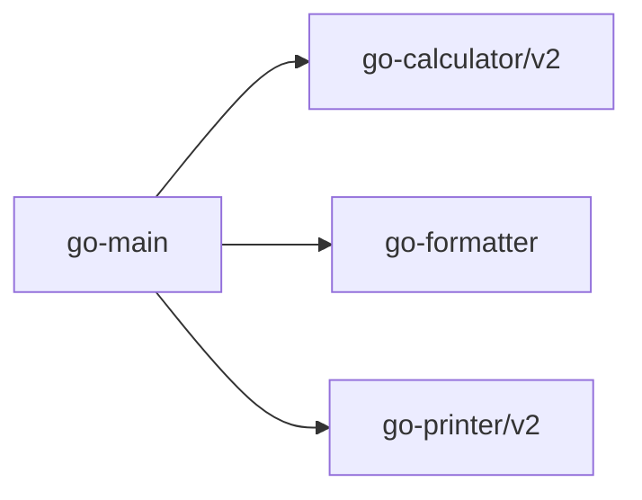

# chatgpt4generated-go-printer

chatGPT4 generated _go_printer_ module (current versions: v2)

One of the dependencies for: chatgpt4generated-_go-main_

part of the multi-module example

Dependency graph:
